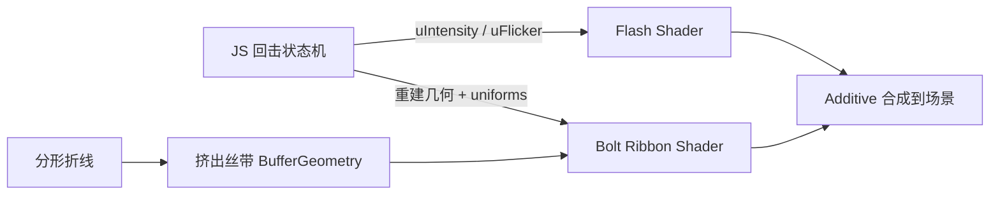

# 着色器进阶：以闪电效果为例

> 若尚未理解 UV、片元与 `discard`，请先阅读 [着色器入门：UV 与片元](./着色器入门-UV与片元.md)，并在编辑器插件 **着色器沙盒** 中练完入门档。

本文以 Astral3D 天气系统中的闪电实现（`packages/sdk/lib/core/objects/weather/Lighting.ts`）为完整案例，系统讲解中高阶着色器知识。假设你已会写简单的 `ShaderMaterial`（uniform、varying、基础光照），本文重点在：**坐标系与裁剪空间、程序化几何与着色器分工、径向辉光、叠加混合、时间驱动与工程陷阱**。

---

## 0. 先建立全局图景

真实项目里的「特效着色器」很少是「一段 fragment 搞定一切」。闪电最终采用的是：

| 层 | 职责 | 为什么放这里 |
| --- | --- | --- |
| **CPU / JS** | 分形折线、分叉、回击状态机、衰减曲线 | 折线拓扑、离散事件更适合 CPU；也避免超长 fragment 在部分 GPU 上编译失败 |
| **几何** | 把折线挤成「丝带」(ribbon) Mesh | `Line` 几乎无法做可变线宽与软边；丝带能带 UV |
| **顶点着色器** | 直接输出 **clip-space / NDC** 坐标 | 贴屏特效不跟相机透视走，避免世界矩阵干扰 |
| **片元着色器** | 芯光 + 光晕、闪丝扰动、天空闪照遮罩 | 真正决定「像不像电」的视觉 |

学习建议：把「着色器」理解成 **GPU 上的着色函数**，把「特效」理解成 **CPU 状态 + 几何载体 + GPU 着色** 三者的组合。



---

## 1. 坐标系：为什么闪电要「绕过」MVP

### 1.1 三条常见坐标链

普通 Mesh：

```
object local → modelMatrix → world → viewMatrix → eye → projectionMatrix → clip → ÷w → NDC → viewport
```

闪电的顶着色器却是：

```glsl
gl_Position = vec4(position.xy, 0.0, 1.0);
```

含义：

- 顶点的 `position.xy` **直接当作 NDC**（约在 `[-1,1]`）
- `z = 0, w = 1`：落在近远裁剪之间，且不做透视除法缩放
- **完全忽略** `modelViewMatrix` / `projectionMatrix`

这叫 **clip-space fullscreen / screen-space overlay** 手法，雨、雪、UI 后处理全屏面片常用。

### 1.2 几何尺寸必须匹配

`PlaneGeometry(2, 2)` 的顶点正好在 `±1`，配合上面的顶着色器刚好铺满屏幕。

若写成 `PlaneGeometry(200, 200)` 再 `gl_Position = vec4(position, 1.0)`，理论上裁剪后也能盖住屏幕，但包围盒巨大，**极易被视锥剔除**。本项目最终对闪电组设置：

```ts
this.mesh.frustumCulled = false;
this.flashMesh.frustumCulled = false;
this.boltMesh.frustumCulled = false;
```

**进阶要点**：自定义 `gl_Position` 时，世界变换只影响 CPU 侧的包围体计算，不再影响最终像素位置——所以 `frustumCulled` 必须按「屏幕特效」来关。

### 1.3 `gl_FragCoord` 与分辨率

闪照片元里：

```glsl
vec2 q = gl_FragCoord.xy / max(uResolution, vec2(1.0));
```

- `gl_FragCoord`：帧缓冲像素坐标（含 devicePixelRatio 放大后的尺寸）
- `uResolution`：必须与 **实际绘制缓冲尺寸** 一致，否则 `q` 会漂出 `[0,1]`，遮罩错位

JS 侧每帧：

```ts
res.set(window.innerWidth, window.innerHeight).multiplyScalar(window.devicePixelRatio);
```

生产中更稳妥的是用 `renderer.domElement.width/height`（已含 DPR），避免窗口尺寸 ≠ canvas 尺寸。

---

## 2. 程序化几何：丝带比「画线」更着色器友好

### 2.1 为什么不用 `LineSegments`

WebGL 的 `gl.LINES`：

- 线宽在绝大多数平台被固定为 1px
- 没有可靠的「软边 / 光晕」
- 难以表达「越往下越细」

所以闪电把折线 **挤出成四边形条带（ribbon）**，每个点带：

| attribute | 含义 |
| --- | --- |
| `position` | NDC 平面上的四边形角点 |
| `uv` | 横向 `0→1`（中心 0.5）、纵向沿段 |
| `along` | 沿路径累计弧长，供闪丝扰动 |

### 2.2 法向挤出（2D）

对线段 `A→B`：

```
dir = normalize(B - A)
n   = (-dir.y, dir.x)   // 左侧法向
halfWidth * taper * n     // 左右各偏一半
```

每段生成两个三角形。`taper` 随路径进度衰减，模拟电弧末梢变细——这是 **几何侧造型**，片元再叠一层软边。

### 2.3 双层丝带：芯 + 晕

```ts
const glowPaths = paths.map(p => ({ points: p.points, width: p.width * 4.5 }));
const all = glowPaths.concat(paths); // 先宽后窄，窄的画在上面
```

宽丝带在片元里同样用高斯衰减，贡献大面积蓝晕；窄丝带贡献白芯。这是 **多 pass / 多层几何模拟 bloom** 的廉价替代（无需后处理）。

**进阶对照**：

| 方案 | 优点 | 缺点 |
| --- | --- | --- |
| 后处理 Bloom | 物理感强、统一 | 贵、全局发光难控 |
| 多层 Additive 丝带 | 可控、便宜 | 需自己调半径与强度 |
| SDF 纯片元画闪 | 无需动态几何 | 分支多、长循环易编译失败/掉帧 |

本项目早期纯 fragment SDF 版本曾出现「开了却看不见」类问题；现架构把拓扑放 CPU，着色器只做 **局部 1D 剖面着色**，更稳。

---

## 3. 片元核心：径向辉光与多瓣高斯

电弧片元（简化）：

```glsl
float d = abs(vUv.x - 0.5) * 2.0;   // 0=中心, 1=边缘
float core = exp(-d * d * 28.0);    // 很尖的芯
float mid  = exp(-d * d *  8.0) * 0.55;
float glow = exp(-d * d *  1.8) * 0.35;
float shape = (core * 1.4 + mid + glow) * filament;
```

### 3.1 为什么用 `exp(-k d²)`

这是高斯（Gaussian）剖面：

- `k` 越大，峰越尖 → **芯**
- `k` 越小，拖尾越长 → **光晕**

比 `smoothstep` 硬切更接近真实发光体的能量分布。多个不同 `k` 的高斯相加，等于手工做 **多尺度能量瓣（multi-lobe）**，视觉上接近「HDR 芯 + LDR 晕」。

### 3.2 沿路径的闪丝 `filament`

```glsl
float filament = 0.85 + 0.15 * sin(vAlong * 40.0 + uTime * 30.0);
```

- `vAlong`：CPU 写入的弧长属性 → 扰动沿电弧「爬行」
- 与单纯 `sin(uTime)` 全段同相位不同，看起来像电流在抖动

这是典型的 **把「空间参数化」交给 attribute，把「时间」交给 uniform**。

### 3.3 色温混合

```glsl
vec3 hot  = vec3(1.0);                              // 芯：接近白热
vec3 cool = mix(uColor, vec3(0.65, 0.82, 1.0), 0.45); // 晕：偏冷蓝
vec3 col  = mix(cool, hot, core);
col *= (0.9 + 1.4 * core) * uIntensity;
```

用 `core` 同时驱动：

1. 颜色从冷到热  
2. 亮度额外加成  

真实闪电照片里，芯过曝发白、外围发青紫——这是廉价但有效的 **艺术化色温模型**。

---

## 4. 闪照 Pass：屏幕空间遮罩设计

天空闪照是另一张全屏 `PlaneGeometry(2,2)`：

```glsl
float sky = pow(smoothstep(0.0, 0.85, q.y), 1.15);
float vig = 1.0 - 0.35 * length((q - vec2(0.5, 0.55)) * vec2(1.2, 1.0));
vec3 col = uColor * sky * vig * (...);
col += uColor * pow(sky, 2.5) * 0.45 * uIntensity; // 云底二次抬亮
```

### 4.1 `smoothstep` 作软遮罩

`smoothstep(edge0, edge1, x)` 在区间内做 Hermite 平滑插值，是遮罩、溶解、AA 的基本功。这里：

- 下方地面几乎不亮  
- 上方天空逐渐亮起  

### 4.2 `pow` 塑造响应曲线

`pow(sky, 2.5)` 把能量进一步压向「更高的天空」，模拟云层底部被照亮，而不是均匀铺一层灰白。

### 4.3 Vignette 式中心权重

`length(q - center)` 让闪照略偏画面中上，避免四角一样亮导致「贴了层纸」。

---

## 5. 混合、Tone Mapping 与 `discard`

材质关键配置：

```ts
{
  transparent: true,
  depthTest: false,
  depthWrite: false,
  blending: THREE.AdditiveBlending,
  toneMapped: false,
}
```

### 5.1 Additive 的物理含义

近似：`dst = dst + src.rgb * src.a`（具体因子以 Three 实现为准）。

适合火焰、激光、闪电——**只加光、不遮挡**。

注意：若 `gl_FragColor = vec4(col, a)` 且 `a` 很小，亮度会被 alpha 因子压暗。本实现采用雨效同款策略：

```glsl
gl_FragColor = vec4(col * a, 1.0);
```

把能量乘进 RGB，alpha 固定为 1，让 Additive 更可预期。

### 5.2 `toneMapped: false`

开启色调映射时，极亮值会被压回可显示范围，发光「糊成一片灰」。特效叠加层常关 tone mapping，自己控制峰值。

### 5.3 `discard` 的取舍

```glsl
if (a < 0.004) discard;
```

- 优点：不写几乎为 0 的片元，减少无效混合  
- 缺点：打断 Early-Z / 可能影响部分优化；全屏闪照在强度为 0 时整片 discard 仍有开销  

更干净的做法是 JS 侧 `mesh.visible = intensity > ε`（本实现已做）。

### 5.4 `depthTest / depthWrite = false`

屏幕特效必须压在场景之上且不写入深度，否则会被地形挡住或弄乱后续透明排序。配合高 `renderOrder`（998 / 999）。

---

## 6. 时间与事件：着色器外的「动画曲线」

闪电「像真」很大程度不靠噪声，而靠 **回击时序**：

1. 冷却 `cooldown`  
2. 主闪高强度  
3. 1～2 次回闪（峰值更低）  
4. 指数衰减 `intensity *= exp(-dt * decay)`  
5. 高频 `flicker` 微抖  

片元只消费：

```ts
uIntensity, uFlicker, uTime, uAlpha, uColor
```

**进阶认知**：好的特效着色器是「哑的」——复杂状态机在 CPU；GPU 负责每帧的连续着色。这与游戏里的 VFX Graph / Niagara 思路一致：模块出数值，材质消费数值。

衰减用指数而非线性，对应「电荷快速泄放」的观感：

\[
I_{t+\Delta t} = I_t \cdot e^{-k\Delta t}
\]

`size` 参与 `k` 的调制：越大衰减越慢，闪留得更久。

---

## 7. 哈希与分形：程序化形状的通用语言

虽在 CPU，但与片元噪声同源：

```ts
function hash(n: number): number {
  const x = Math.sin(n * 127.1) * 43758.5453;
  return x - Math.floor(x);
}
```

### 7.1 伪随机性质

- 确定性：同 seed → 同形状（可复现）  
- 不连续：相邻整数输入输出无关 → 适合「每个事件换一条闪」

GLSL 版常见写法：

```glsl
float hash(float n) {
  return fract(sin(n) * 43758.5453123);
}
```

### 7.2 中点位移分形（Midpoint Displacement）

```
对线段 AB：取中点 M，沿法向偏移 random * roughness * |AB|
再递归细分，roughness *= 0.72
```

这是 1D 分形布朗运动的离散版，用来生成「锯齿但不均匀」的电弧。着色器里若用 SDF 画闪，等价思路是：折线节点用 hash 扰动。

---

## 8. 两种闪电架构对比（强烈建议动手）

### A. 纯片元 SDF（曾用过的路线）

```glsl
// 伪代码：对每段折线求点到线段距离，累加 exp(-d/w)
float bolt = 0.0;
for (int i = 0; i < N; i++) {
  bolt += glow(distToSegment(uv, p[i], p[i+1]));
}
```

| 优点 | 风险 |
| --- | --- |
| 无需动态几何 | 循环 + 分支：编译失败 / 超时 |
| 分辨率无关 | 每像素高开销 |
| 易做软边 | 宽屏 UV/aspect 易把闪挤出画面 |

### B. 当前：CPU 折线 + Ribbon + 简单片元

| 优点 | 风险 |
| --- | --- |
| 着色器短、稳 | 几何重建有 CPU 成本 |
| 线宽、分叉可控 | 属屏幕空间，非真实 3D 深度闪 |
| 与雨雪同一套贴屏哲学 | 需关 frustumCulled |

**练习**：把电弧改成世界空间 3D（从云层高度打到地面），片元仍用丝带 UV 剖面——你会同时练到 billboard 与相机对齐。

---

## 9. 知识清单：这篇覆盖了哪些「中高阶」点

1. **Clip-space / NDC 直写** 与视锥剔除陷阱  
2. **屏幕空间遮罩**：`gl_FragCoord`、`smoothstep`、`pow`、vignette  
3. **自定义 attribute** 驱动空间参数化（`along`）  
4. **几何挤出 ribbon** 作为「可变宽软线」载体  
5. **多瓣高斯辉光** 与色温 `mix`  
6. **Additive + toneMapped:false + RGB 预乘能量**  
7. **CPU 状态机驱动 uniform**（事件型特效）  
8. **哈希 / 分形** 作为程序化形状语言  
9. **架构选型**：SDF 全片元 vs 混合管线  

---

## 10. 动手练习（由易到难）

1. **只改片元**：把 `core/mid/glow` 的三个 `k` 做成 uniform，侧栏滑条调出「细激光」和「胖电弧」。  
2. **只改闪照**：用 `noise(q * scale + uTime)` 让天空闪照带云絮状不均匀。  
3. **双闪**：一次回击生成两条 seed 不同的 ribbon，强度 1.0 / 0.4。  
4. **SDF 版迷你闪**：在 200×200 全屏面片上只用 8 段折线 SDF，对比帧耗与观感。  
5. **后处理**：关自绘 glow，给场景开 UnrealBloomPass，只画硬芯——体会 bloom 与自绘晕的差异。  

---

## 11. 对应源码导航

| 主题 | 位置 |
| --- | --- |
| 分形折线 / 分叉 | `buildBoltPolylines` / `fractalPolyline` |
| 丝带挤出 | `pathsToRibbonGeometry` |
| 闪照片元 | `flashMat.fragmentShader` |
| 电弧片元 | `boltMat.fragmentShader` |
| 回击状态机 | `triggerStrike` / `fireStroke` / `update` |
| 接入天气系统 | `Weather.sceneLightningSettingsChanged` |

文件：`packages/sdk/lib/core/objects/weather/Lighting.ts`。

---

## 12. 延伸阅读方向

- Inigo Quilez：距离场、平滑最小值、造型函数  
- GPU Gems / Advancements in Real-Time Rendering：粒子与闪电案例  
- Three.js：`ShaderMaterial`、`RawShaderMaterial`、`onBeforeCompile`  
- 颜色管理：linear workflow 下 Additive 为何「容易爆」  

---

## 结语

闪电这个案例的价值不在「又会写一段酷炫 GLSL」，而在建立中高阶特效的正确心智：

> **形态在几何与状态机里长出来，美感在片元的能量分布与混合模式里留下来；坐标系选错，再好的公式也等于没画。**

读完后建议你对照源码，把 `uIntensity` 从 0 拉到 1 时闪照与电弧各自的响应曲线在纸上画出来——能画曲线，才算真正掌握了这段着色器。
